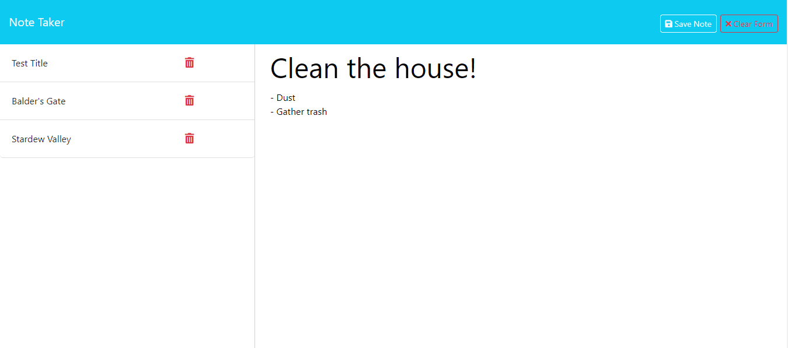

  # note-taker
  

  ## Description
  Challenge 11 -- Express.js: Note Taker

  This project was built from starter code that was the front end part of an application called Note Taker, which can be used to write and save notes, and my job was to complete the back end of the application past the starter code using Express.js in order to write the server files, create functionality so that notes will save and be able to be retrieved from a JSON file, and then hosted on Heroku. Throughout completeting this project, I learned how to efficively use the beginnings of express.js, how to create and flow thru routes, how to use better naming conventions, how to create get post and delete html methods and follow those thru with correct pathing, and finally how to accurately deploy to Heroku either directly or thru the commmand line interface.

  ## Table of Contents
  - [Installation](#installation)
  - [Usage](#usage)
  - [License](#license)
  - [Badges](#badges)
  - [Features](#features)
  - [Questions](#questions)

  ## Installation
  * This project has been deployed thru Heroku for general usage, link found in Usage section below

  * Please be sure to use 'npm i' command in order to download the necessary dependencies to run the code if testing, listed inside the package.json

  ## Usage
  -- link 
  
  Screenshot of completed site:
  

  ## License
  [MIT License](https://opensource.org/licenses/MIT)

  ## Badges
  

  ## Features
  * HTML 
  * CSS 
  * Bootstrap
  * JavaScript
  * Express.js
  * UUID
  * Heroku 

  ## Questions
  If you have any questions, feel free to reach out to me via [GitHub](https://github.com/jskelly8/) or email me at jessskelton888@gmail.com.
